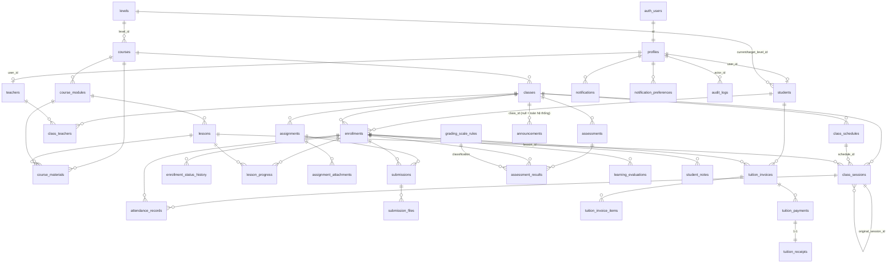

# 02 — Thiết kế Database

> Nguồn sự thật về **yêu cầu schema**. Khi đã có migration, **migration là nguồn sự thật về implementation** — nếu lệch, sửa cho khớp và cập nhật file này trong cùng bộ thay đổi để user commit cùng nhau.

---

## 1. Quy ước chung

| Hạng mục   | Quy ước                                                                                                                                                         |
| ---------- | --------------------------------------------------------------------------------------------------------------------------------------------------------------- |
| Khóa chính | `uuid` mặc định `gen_random_uuid()`. Riêng `profiles.id` = `auth.users.id`.                                                                                     |
| Đặt tên    | `snake_case`, bảng số nhiều (`students`, `class_sessions`)                                                                                                      |
| Thời gian  | `timestamptz`, **luôn lưu UTC**. Ngày thuần (không giờ) dùng `date`.                                                                                            |
| Timestamps | Mọi bảng nghiệp vụ có `created_at`, `updated_at`; `updated_at` do trigger `set_updated_at()` tự cập nhật                                                        |
| Enum       | **PostgreSQL enum type** (không dùng text + CHECK), đặt trong schema `public`. Mở rộng bằng `ALTER TYPE ... ADD VALUE` — migration-safe.                        |
| Tiền       | `numeric(14,2)` — không dùng float                                                                                                                              |
| Điểm       | `numeric(5,2)`, CHECK `0..100` (hoặc `0..max_score` với bài tập)                                                                                                |
| Xóa        | **Không hard delete dữ liệu lịch sử.** Dùng `status`/`archived_at`. FK mặc định `ON DELETE RESTRICT`; `CASCADE` chỉ cho child thuần (attachment, invoice item). |
| Index      | Bắt buộc index mọi FK, mọi cột dùng trong RLS policy, và cột filter chính                                                                                       |
| Schema phụ | `app` — chứa helper function `SECURITY DEFINER` cho RLS. Revoke `EXECUTE` khỏi `anon`.                                                                          |

**Múi giờ:** DB lưu UTC. Tầng ứng dụng hiển thị và sinh recurrence theo `Asia/Ho_Chi_Minh`. Không lưu giờ địa phương xuống DB.

---

## 2. Enum types

```sql
user_role            : super_admin | teacher | student
course_type          : hsk | communication | kids | exam_prep | business_custom | custom
course_status        : draft | active | archived
material_visibility  : staff_only | enrolled_students   -- ai được thấy tài liệu
class_status         : planned | active | paused | completed | cancelled
delivery_mode        : offline | online | hybrid | in_house
assignment_role      : primary | assistant              -- vai trò GV trong lớp
session_status       : scheduled | completed | cancelled | rescheduled
enrollment_status    : pending | active | paused | completed | withdrawn | transferred
attendance_status    : present | late | absent | excused
lesson_progress_status : not_started | in_progress | completed
assignment_status    : draft | published | closed
submission_status    : submitted | graded | returned
assessment_type      : quiz | midterm | final | mock_hsk | speaking | custom
evaluation_rating    : weak | average | good | excellent
note_visibility      : staff_only | student_visible
invoice_status       : draft | issued | partial | paid | overdue | cancelled | refunded
payment_method       : cash | bank_transfer | card | e_wallet | other
notification_type    : session_upcoming | session_changed | assignment_new | assignment_due
                     | assessment_upcoming | result_published | attendance_absent
                     | invoice_new | invoice_due | invoice_overdue | announcement
```

---

## 3. ERD



---

## 4. Chi tiết bảng

### 4.1 Danh tính

#### `profiles`

| Cột                         | Kiểu        | Ràng buộc                                   |
| --------------------------- | ----------- | ------------------------------------------- |
| `id`                        | uuid        | PK, FK → `auth.users(id)` ON DELETE CASCADE |
| `role`                      | `user_role` | NOT NULL                                    |
| `full_name`                 | text        | NOT NULL                                    |
| `phone`                     | text        |                                             |
| `avatar_path`               | text        | object path trong bucket `avatars`          |
| `is_active`                 | boolean     | NOT NULL DEFAULT true                       |
| `created_at` / `updated_at` | timestamptz | NOT NULL DEFAULT now()                      |

- **Role chỉ được set/đổi bởi admin function server-only.** Policy UPDATE của chính chủ **không cho** đụng vào `role` và `is_active` (chặn bằng trigger `prevent_self_privilege_escalation`).
- `is_active = false` → chặn ở cả middleware lẫn RLS (helper `app.is_active()`).
- Index: `role`, `is_active`.

#### `teachers`

`id` uuid PK · `user_id` uuid **UNIQUE NOT NULL** FK → `auth.users(id)` ON DELETE RESTRICT · `teacher_code` text **UNIQUE NOT NULL** · `specialization` text · `bio` text · `is_active` boolean NOT NULL DEFAULT true · timestamps.

Index: `user_id`, `is_active`.

#### `students`

`id` uuid PK · `user_id` uuid **UNIQUE, NULL được** FK → `auth.users(id)` ON DELETE SET NULL — _cho phép tạo hồ sơ trước, invite sau_ · `student_code` text **UNIQUE NOT NULL** · `full_name` text NOT NULL · `dob` date · `gender` text · `phone` text · `email` text · `address` text · `guardian_name` / `guardian_phone` / `guardian_relation` text _(chỉ là thông tin liên hệ — **không** phải tài khoản)_ · `current_level_id` / `target_level_id` uuid FK → `levels` ON DELETE SET NULL · `learning_goal` text · `joined_on` date · `status` text NOT NULL DEFAULT `'active'` · `note` text · `archived_at` timestamptz · timestamps.

Index: `user_id`, `student_code`, `status`, `current_level_id`.

---

### 4.2 Chương trình đào tạo

#### `levels`

`id` uuid PK · `code` text UNIQUE NOT NULL · `name` text NOT NULL · `framework` text DEFAULT `'HSK'` · `order_index` int NOT NULL · `description` text · `is_active` boolean DEFAULT true · timestamps.

Danh mục cấu hình được — **không hard-code HSK thành enum** để trung tâm còn tạo được level nội bộ.

#### `courses`

| Cột                                  | Kiểu                                       | Ghi chú                                       |
| ------------------------------------ | ------------------------------------------ | --------------------------------------------- |
| `id`                                 | uuid PK                                    |                                               |
| `code`                               | text UNIQUE NOT NULL                       | `HSK1`, `LT-HSK`, `VCB-EXEC`…                 |
| `title`                              | text NOT NULL                              |                                               |
| `title_en`                           | text                                       |                                               |
| `course_type`                        | `course_type` NOT NULL                     |                                               |
| `level_id`                           | uuid FK → `levels` ON DELETE SET NULL      | **nullable** — khóa tùy chỉnh không gắn level |
| `target_audience`                    | text                                       |                                               |
| `objectives` / `description`         | text                                       |                                               |
| `default_session_count`              | int CHECK > 0                              | **nullable** ở catalog                        |
| `default_session_duration_minutes`   | int CHECK > 0                              | **nullable** ở catalog                        |
| `default_tuition_amount`             | numeric(14,2) CHECK ≥ 0                    | nullable                                      |
| `completion_min_attendance_rate`     | numeric(5,2) CHECK 0..100                  | DEFAULT 80                                    |
| `completion_min_overall_score`       | numeric(5,2) CHECK 0..100                  | DEFAULT 50                                    |
| `completion_require_all_assignments` | boolean                                    | DEFAULT false                                 |
| `status`                             | `course_status` NOT NULL DEFAULT `'draft'` |                                               |
| `created_by`                         | uuid FK → `auth.users` ON DELETE SET NULL  |                                               |
| timestamps                           |                                            |                                               |

#### `course_modules`

`id` uuid PK · `course_id` FK → `courses` ON DELETE **CASCADE** · `title` NOT NULL · `description` · `order_index` int NOT NULL · **UNIQUE `(course_id, order_index)`** · timestamps.

#### `lessons`

`id` uuid PK · `module_id` FK → `course_modules` ON DELETE **CASCADE** · `title` NOT NULL · `objectives` · `content_summary` · `planned_duration_minutes` int · `order_index` int NOT NULL · **UNIQUE `(module_id, order_index)`** · timestamps.

> `course_id` truy được qua `module_id` → **không** lưu lặp `course_id` ở `lessons` (tránh hai nguồn sự thật lệch nhau).

#### `course_materials`

`id` uuid PK · `course_id` FK NOT NULL (ON DELETE CASCADE) · `module_id` FK nullable · `lesson_id` FK nullable · `title` NOT NULL · `object_path` text NOT NULL (bucket `course-materials`) · `mime_type` · `size_bytes` bigint · `visibility` `material_visibility` NOT NULL DEFAULT `'enrolled_students'` · `uploaded_by` uuid FK · timestamps.

FK thật cho cả 3 cấp — **không dùng polymorphic UUID mềm** như hệ cũ. CHECK: `module_id`/`lesson_id` nếu có phải thuộc đúng `course_id` (kiểm bằng trigger `enforce_material_hierarchy`).

**`uploaded_by` do DB quyết định, không phải app** _(migration 21, `force_material_uploader`)_: trigger ghi đè bằng `auth.uid()` khi INSERT và giữ **bất biến** khi UPDATE. Lý do: RLS cho phép admin/giáo viên INSERT thẳng qua PostgREST bằng JWT của họ — đường đó không đi qua server action, nên nếu tin vào app thì client tự khai `uploaded_by` là ai cũng được (đã kiểm chứng: insert thẳng qua PostgREST → `uploaded_by` = NULL). Đây đúng lớp bug `BUG_M06_01`/`BUG_M12_01` của hệ XKLĐ cũ.

**`object_path` do SERVER sinh**, dạng `{course_id}/{uuid}.{ext}`, đuôi file lấy từ allowlist (`lib/domain/files.ts`). Không bao giờ nhận path client gửi lên — thư mục gốc chính là thứ policy Storage soi để phân quyền.

---

### 4.3 Lớp, lịch, ghi danh

#### `classes`

| Cột                                                           | Kiểu                                            | Ghi chú                                                                       |
| ------------------------------------------------------------- | ----------------------------------------------- | ----------------------------------------------------------------------------- |
| `id`                                                          | uuid PK                                         |                                                                               |
| `code`                                                        | text UNIQUE NOT NULL                            | `LOP-01`…                                                                     |
| `course_id`                                                   | uuid FK → `courses` ON DELETE RESTRICT NOT NULL |                                                                               |
| `name`                                                        | text NOT NULL                                   |                                                                               |
| `target_audience`                                             | text                                            | override của course, nullable                                                 |
| `capacity`                                                    | int NOT NULL **CHECK > 0**                      |                                                                               |
| `planned_session_count`                                       | int CHECK > 0                                   | phải có giá trị trước khi `active`                                            |
| `session_duration_minutes`                                    | int CHECK > 0                                   | phải có giá trị trước khi `active`                                            |
| `start_date`                                                  | date                                            |                                                                               |
| `expected_end_date`                                           | date CHECK ≥ `start_date`                       |                                                                               |
| `delivery_mode`                                               | `delivery_mode` NOT NULL                        |                                                                               |
| `location_name` / `address` / `meeting_url` / `location_note` | text                                            | nullable theo mode; `location_note` cho phép **mô tả tự do** (lớp `in_house`) |
| `status`                                                      | `class_status` NOT NULL DEFAULT `'planned'`     |                                                                               |
| `created_by`                                                  | uuid FK                                         |                                                                               |
| timestamps                                                    |                                                 |                                                                               |

Index: `course_id`, `status`, `start_date`.

#### `class_teachers`

`id` uuid PK · `class_id` FK ON DELETE CASCADE · `teacher_id` FK → `teachers` ON DELETE RESTRICT · `assignment_role` `assignment_role` NOT NULL · **UNIQUE `(class_id, teacher_id)`** · timestamps.

```sql
-- Mỗi lớp tối đa MỘT giáo viên chính
CREATE UNIQUE INDEX ux_class_teachers_one_primary
  ON class_teachers (class_id) WHERE assignment_role = 'primary';
```

Đây là **bảng trung tâm của toàn bộ RLS giáo viên**. Index `(teacher_id, class_id)` bắt buộc.

#### `class_schedules`

`id` uuid PK · `class_id` FK ON DELETE CASCADE · `weekday` smallint NOT NULL **CHECK 1..7** (ISO: 1 = Thứ Hai) · `start_time` time NOT NULL · `end_time` time NOT NULL **CHECK `end_time > start_time`** · `effective_from` date · `effective_to` date CHECK ≥ `effective_from` · `timezone` text NOT NULL DEFAULT `'Asia/Ho_Chi_Minh'` · timestamps.

**Lớp linh hoạt (`LOP-01`) được phép không có row nào.**

#### `class_sessions`

| Cột                                     | Kiểu                                            | Ghi chú                                 |
| --------------------------------------- | ----------------------------------------------- | --------------------------------------- |
| `id`                                    | uuid PK                                         |                                         |
| `class_id`                              | uuid FK ON DELETE CASCADE NOT NULL              |                                         |
| `schedule_id`                           | uuid FK → `class_schedules` ON DELETE SET NULL  | nguồn sinh ra buổi này                  |
| `lesson_id`                             | uuid FK → `lessons` ON DELETE SET NULL          | bài học dự kiến                         |
| `session_number`                        | int NOT NULL                                    | **UNIQUE `(class_id, session_number)`** |
| `starts_at` / `ends_at`                 | timestamptz NOT NULL                            | **UTC**, CHECK `ends_at > starts_at`    |
| `topic` / `lesson_log` / `teacher_note` | text                                            | `lesson_log` = nội dung **thực dạy**    |
| `status`                                | `session_status` NOT NULL DEFAULT `'scheduled'` |                                         |
| `original_session_id`                   | uuid FK → `class_sessions` ON DELETE SET NULL   | buổi gốc, cho học bù/đổi lịch           |
| `completed_at` / `completed_by`         |                                                 |                                         |
| timestamps                              |                                                 |                                         |

Index: `class_id`, `starts_at`, `(class_id, starts_at)`, `status`.

> **Idempotency khi sinh buổi:** UNIQUE `(class_id, session_number)` là chốt chặn ở DB. RPC `generate_class_sessions` phải `INSERT ... ON CONFLICT DO NOTHING` và dừng đúng `planned_session_count`.

#### `enrollments`

`id` uuid PK · `student_id` FK → `students` ON DELETE RESTRICT · `class_id` FK → `classes` ON DELETE RESTRICT · ~~UNIQUE `(student_id, class_id)`~~ **(đã gỡ ở migration 23 — xem D-19 bên dưới)** · `status` `enrollment_status` NOT NULL DEFAULT `'pending'` · `enrolled_on` date NOT NULL DEFAULT current_date · `started_on` / `ended_on` date · `reason` text · `tuition_override_amount` numeric(14,2) CHECK ≥ 0 nullable · `created_by` uuid FK · timestamps.

```sql
-- MỘT HỌC VIÊN CHỈ MỘT LỚP TẠI MỘT THỜI ĐIỂM (user chốt 2026-07-13,
-- đảo ngược yêu cầu ban đầu của đặc tả gốc).
--
-- Partial index: lớp đã ĐÓNG (completed/withdrawn/transferred) KHÔNG tính
--   → học xong HSK 1 vẫn đăng ký được HSK 2 (lịch sử lớp cũ giữ nguyên)
--   → chuyển lớp vẫn chạy (lớp cũ thành `transferred` = đã đóng)
--   → D-19: học viên RỚT được HỌC LẠI chính lớp đó (migration 23 gỡ
--     `uq_enrollments_student_class`). Index này vẫn chặn hai ghi danh cùng mở,
--     kể cả trong cùng một lớp — nên D-18 không bị phá.
--     Mỗi lần học là MỘT enrollment riêng; điểm danh/điểm/bài nộp treo vào
--     `enrollment_id` nên lịch sử lần trước không trộn với lần học lại.
CREATE UNIQUE INDEX ux_enrollments_one_open_per_student
  ON enrollments (student_id)
  WHERE status IN ('pending', 'active', 'paused');
```

Index: `student_id`, `class_id`, `status`, `(class_id, status)`.

#### `enrollment_status_history`

`id` uuid PK · `enrollment_id` FK ON DELETE CASCADE · `old_status` `enrollment_status` (null khi tạo mới) · `new_status` `enrollment_status` NOT NULL · `reason` text · `changed_by` uuid FK · `changed_at` timestamptz NOT NULL DEFAULT now().

**Append-only** (không policy UPDATE/DELETE cho bất kỳ role nào).

---

### 4.4 Điểm danh & tiến độ

#### `attendance_records`

`id` uuid PK · `session_id` FK → `class_sessions` ON DELETE CASCADE · `enrollment_id` FK → `enrollments` ON DELETE CASCADE · **UNIQUE `(session_id, enrollment_id)`** ← _khóa chống trùng cho bulk upsert_ · `status` `attendance_status` NOT NULL · `check_in_at` timestamptz · `note` text · `marked_by` uuid FK NOT NULL · `marked_at` timestamptz NOT NULL DEFAULT now() · timestamps.

Trigger `enforce_attendance_class_match`: chặn tạo bản ghi mà `enrollment.class_id ≠ session.class_id`.

⚠️ `session_id` là **ON DELETE CASCADE** → xóa một buổi học sẽ cuốn theo toàn bộ điểm danh của buổi đó. Vì vậy migration 22 thêm trigger `prevent_session_delete_with_history`: **không xóa được** buổi đã dạy (`completed`) hoặc buổi đã có điểm danh — muốn bỏ thì **hủy** (`status = 'cancelled'`), giữ lại vết. Buổi `scheduled` chưa ai điểm danh vẫn xóa được (đó là buổi sinh nhầm do cấu hình lịch sai, chưa có lịch sử gì để mất).

#### `lesson_progress`

`id` uuid PK · `enrollment_id` FK ON DELETE CASCADE · `lesson_id` FK ON DELETE CASCADE · **UNIQUE `(enrollment_id, lesson_id)`** · `status` `lesson_progress_status` NOT NULL DEFAULT `'not_started'` · `completed_at` timestamptz · `teacher_note` text · `updated_by` uuid FK · timestamps.

> **Không có cột "% tiến độ" nhập tay.** Tiến độ tổng hợp được **tính** ở view `v_enrollment_progress` từ lesson hoàn thành + chuyên cần + bài tập + điểm.

---

### 4.5 Bài tập & bài nộp

#### `assignments`

`id` uuid PK · `class_id` FK ON DELETE CASCADE NOT NULL · `lesson_id` / `session_id` FK nullable ON DELETE SET NULL · `title` NOT NULL · `instructions` text · `due_at` timestamptz · `max_score` numeric(5,2) NOT NULL DEFAULT 100 CHECK > 0 · `allow_late_submission` boolean NOT NULL DEFAULT true · `max_attempts` int NOT NULL DEFAULT 1 CHECK > 0 · `status` `assignment_status` NOT NULL DEFAULT `'draft'` · `published_at` timestamptz · `created_by` uuid FK NOT NULL · timestamps.

Index: `class_id`, `(class_id, published_at)`, `due_at`.

**Toàn vẹn khi triển khai (migration 25):** INSERT luôn bị ép về `status = 'draft'`, `published_at = NULL`; `created_by` lấy từ `auth.uid()` và bất biến; `lesson_id` phải thuộc course của lớp, `session_id` phải thuộc chính lớp đó. Role `authenticated` không được UPDATE trực tiếp `status`/`published_at`: publish/close đi qua RPC riêng. Assignment đã publish hoặc đã có submission **không hard-delete được**; chuyển sang `closed` để giữ lịch sử. Bản nháp chưa có lịch sử vẫn xóa được.

#### `assignment_attachments`

`id` uuid PK · `assignment_id` FK ON DELETE CASCADE · `object_path` NOT NULL (bucket `assignment-files`) · `file_name` · `mime_type` · `size_bytes` bigint · `uploaded_by` uuid FK · `created_at`.

`object_path` là UNIQUE và bắt buộc đúng `{class_id}/{assignment_id}/{uuid}.{ext}`; `uploaded_by` do DB ghi đè bằng actor thật và bất biến khi UPDATE.

#### `submissions`

`id` uuid PK · `assignment_id` FK ON DELETE CASCADE · `enrollment_id` FK ON DELETE CASCADE · **UNIQUE `(assignment_id, enrollment_id)`** (bản ghi hiện hành) · `attempt_no` int NOT NULL DEFAULT 1 · `text_answer` text · `submitted_at` timestamptz · `is_late` boolean NOT NULL DEFAULT false · `status` `submission_status` NOT NULL DEFAULT `'submitted'` · `score` numeric(5,2) **CHECK `score >= 0`** · `feedback` text · `graded_by` uuid FK · `graded_at` timestamptz · timestamps.

- `score ≤ assignment.max_score` — kiểm bằng trigger (CHECK không tham chiếu được bảng khác); thao tác chấm đi qua RPC `grade_submission`.
- **Trạng thái nộp ban đầu do DB quyết định** _(migration 26)_: assignment/enrollment phải cùng lớp, assignment phải đã publish; DB tự đặt `submitted_at`, `attempt_no = 1`, `is_late`, `status = 'submitted'` và xóa mọi điểm/feedback/actor do client tự khai. Assignment đóng hoặc quá hạn mà không cho nộp muộn thì fail-closed.
- Role `authenticated` chỉ được UPDATE trực tiếp cột `text_answer`. Học viên chỉ sửa nội dung trước khi chấm và khi assignment còn mở; giáo viên/admin không được sửa nội dung của học viên. `score` / `feedback` / `graded_by` / `graded_at` chỉ được ghi qua RPC, actor luôn là `auth.uid()`.
- Nếu bật nhiều lần nộp (`max_attempts > 1`) → thêm bảng `submission_attempts` giữ lịch sử, **không ghi đè** bản cũ.

#### `submission_files`

`id` uuid PK · `submission_id` FK ON DELETE CASCADE · `object_path` NOT NULL (bucket `submissions`) · `file_name` · `mime_type` · `size_bytes` bigint · `created_at`.

`object_path` là UNIQUE và bắt buộc đúng `{class_id}/{submission_id}/{uuid}.{ext}`; segment lớp phải khớp lớp của assignment. Học viên chỉ upload/xóa file của bài mình khi chưa chấm; giáo viên lớp khác không thể đọc metadata hoặc tạo signed URL.

---

### 4.6 Kiểm tra & đánh giá

#### `assessments`

`id` uuid PK · `class_id` FK ON DELETE CASCADE NOT NULL · `lesson_id` / `module_id` FK nullable · `type` `assessment_type` NOT NULL · `title` NOT NULL · `assessment_date` date · `max_score` numeric(5,2) NOT NULL DEFAULT 100 **CHECK `0 < max_score ≤ 100`** · `skill_weights` jsonb _(vd `{"listening":25,"speaking":25,"reading":25,"writing":25}`)_ · `published_at` timestamptz · `created_by` uuid FK · timestamps.

- **Thang điểm là 0..100** _(migration 27)_. `grading_scale_rules` và mọi cột điểm của `assessment_results` đều chạy trên 0..100; cho phép `max_score = 300` sẽ tạo ra bài KT không bao giờ nhập nổi điểm đúng thang — bẫy im lặng, nên chốt bằng CHECK.
- **Draft ≠ published** _(migration 27)_: INSERT luôn ép `published_at = null` và `created_by = auth.uid()` cho mọi user flow có JWT. `published_at` / `created_by` / `class_id` **không nằm trong GRANT UPDATE** của `authenticated` → công bố chỉ đi qua RPC, không phải một cột form.
- `lesson_id` / `module_id` phải thuộc đúng khóa học của lớp (trigger). Bài KT **đã công bố không hard delete** được.

#### `assessment_results`

`id` uuid PK · `assessment_id` FK ON DELETE CASCADE · `enrollment_id` FK ON DELETE CASCADE · **UNIQUE `(assessment_id, enrollment_id)`** · `overall_score` numeric(5,2) CHECK **0..100** · `listening_score` / `speaking_score` / `reading_score` / `writing_score` / `vocabulary_score` / `grammar_score` numeric(5,2) CHECK 0..100 **nullable** · `classification` text _(tính từ `grading_scale_rules` bằng trigger — **client không gửi lên**)_ · `feedback` text · `graded_by` uuid FK · `graded_at` timestamptz · `published_at` timestamptz · timestamps.

> Học viên chỉ đọc được row có `published_at IS NOT NULL` — cưỡng chế bằng RLS, không bằng `WHERE` ở tầng app.

- **Một hành động = một đường ghi** _(migration 27)_: `INSERT`/`UPDATE` trực tiếp đã bị REVOKE khỏi `authenticated`. Mọi lần nhập điểm đi qua `save_assessment_result` — upsert theo `(assessment_id, enrollment_id)`, nên bấm Lưu hai lần không sinh hai dòng điểm.
- Trigger kiểm: enrollment phải cùng lớp với bài KT · enrollment `withdrawn`/`transferred` **không** nhận điểm (đã rời lớp) · mọi điểm nằm trong `0..max_score` · `graded_by`/`graded_at` luôn là actor thật từ `auth.uid()`.
- Kết quả **đã công bố không hard delete** được. Sửa điểm sau công bố **không** âm thầm thu hồi kết quả học viên đã thấy (`published_at` không nằm trong nhánh `DO UPDATE`).

#### `grading_scale_rules`

`id` uuid PK · `label` text NOT NULL · `min_score` numeric(5,2) NOT NULL CHECK 0..100 · `max_score` numeric(5,2) NOT NULL CHECK 0..100 · CHECK `max_score > min_score` · `order_index` int · `is_active` boolean DEFAULT true · timestamps.

**EXCLUDE constraint chống chồng lấn ngưỡng:**

```sql
ALTER TABLE grading_scale_rules ADD CONSTRAINT ex_grading_no_overlap
  EXCLUDE USING gist (numrange(min_score, max_score, '[)') WITH &&) WHERE (is_active);
```

Seed mặc định: Yếu `[0,50)` · Trung bình `[50,65)` · Khá `[65,80)` · Giỏi `[80,90)` · Xuất sắc `[90,100]`.

#### `learning_evaluations`

`id` uuid PK · `enrollment_id` FK ON DELETE CASCADE · `period_start` / `period_end` date · `evaluation_date` date NOT NULL · `overall_rating` `evaluation_rating` · `listening_rating` … `grammar_rating` (`evaluation_rating`, nullable) · `strengths` / `areas_for_improvement` / `action_plan` / `teacher_comment` text · `visible_to_student` boolean NOT NULL DEFAULT false · `published_at` timestamptz · `created_by` uuid FK · timestamps.

**Không có tiêu chí tài chính.**

- **Hai cột cùng quyết định "học viên có thấy không"** (`published_at` + `visible_to_student`) là một cái bẫy: bật một cột, quên cột kia → giáo viên tưởng đã gửi mà học viên không thấy gì, hoặc ngược lại. Chốt ở migration 28: **chỉ RPC `publish_evaluation` được đặt hai cột này, và luôn đặt CÙNG NHAU.** Cả hai đã bị REVOKE khỏi `GRANT UPDATE` của `authenticated`.
- INSERT luôn ép về nháp (`published_at = null`, `visible_to_student = false`) và `created_by = auth.uid()` cho mọi user flow có JWT. `created_by` / `enrollment_id` bất biến — đổi enrollment là chuyển đánh giá sang hồ sơ người khác, không phải "sửa".
- Đánh giá **đã gửi cho học viên không hard delete** được.

#### `student_notes`

`id` uuid PK · `enrollment_id` FK ON DELETE CASCADE · `body` text NOT NULL · `visibility` `note_visibility` NOT NULL DEFAULT `'staff_only'` · `created_by` uuid FK NOT NULL · timestamps.

Học viên **tuyệt đối không đọc** `staff_only` — qua API, qua Supabase client trực tiếp, hay qua bất kỳ view nào. *(pgTAP `evaluation_notes.test.sql` kiểm bằng chính JWT của học viên: quét toàn bảng chỉ trả về ghi chú `student_visible`.)*

`created_by` do DB ghi đè bằng `auth.uid()` và bất biến; `enrollment_id` bất biến. Học viên **không** tạo/sửa được ghi chú trong hồ sơ của chính mình *(migration 28)*.

---

### 4.7 Học phí

#### `tuition_invoices`

`id` uuid PK · `invoice_code` text UNIQUE NOT NULL · `student_id` FK → `students` ON DELETE RESTRICT NOT NULL · `enrollment_id` / `class_id` FK nullable ON DELETE SET NULL · `issue_date` date NOT NULL DEFAULT current_date · `due_date` date CHECK ≥ `issue_date` · `subtotal` numeric(14,2) NOT NULL CHECK ≥ 0 · `discount` numeric(14,2) NOT NULL DEFAULT 0 CHECK ≥ 0 · `total` numeric(14,2) NOT NULL **CHECK ≥ 0** · `status` `invoice_status` NOT NULL DEFAULT `'draft'` · `note` text · `created_by` uuid FK · timestamps.

#### `tuition_invoice_items`

`id` uuid PK · `invoice_id` FK ON DELETE **CASCADE** · `description` NOT NULL · `quantity` numeric(10,2) NOT NULL DEFAULT 1 CHECK > 0 · `unit_amount` numeric(14,2) NOT NULL CHECK ≥ 0 · `line_total` numeric(14,2) NOT NULL CHECK ≥ 0 · `created_at`.

#### `tuition_payments`

`id` uuid PK · `payment_code` text UNIQUE NOT NULL · `invoice_id` FK → `tuition_invoices` ON DELETE RESTRICT NOT NULL · `student_id` FK NOT NULL · `amount` numeric(14,2) NOT NULL **CHECK > 0** · `paid_at` timestamptz NOT NULL DEFAULT now() · `method` `payment_method` NOT NULL · `reference` text · `note` text · `recorded_by` uuid FK NOT NULL · timestamps.

Trigger chặn tổng thanh toán vượt `invoice.total` (trừ khi đi qua flow refund tường minh).

#### `tuition_receipts`

`id` uuid PK · `receipt_code` text UNIQUE NOT NULL · `payment_id` uuid **UNIQUE NOT NULL** FK → `tuition_payments` ON DELETE RESTRICT ← _chống sinh phiếu trùng ở tầng DB_ · `issued_at` timestamptz NOT NULL DEFAULT now() · `issued_by` uuid FK · `snapshot` jsonb · `object_path` text nullable · timestamps.

> **Số dư học phí không có bảng riêng.** Tính ở view `v_tuition_balance`. Đây là ranh giới cứng: không để nó mọc thành module công nợ.

---

### 4.8 Thông báo & audit

#### `announcements`

`id` uuid PK · `class_id` FK nullable _(null = toàn hệ thống)_ · `title` NOT NULL · `body` text NOT NULL · `published_at` timestamptz · `expires_at` timestamptz CHECK > `published_at` · `created_by` uuid FK · timestamps. **Không reply/thread/chat.**

Mutation chỉ qua `save_announcement` / `publish_announcement` / `expire_announcement`. `created_by = auth.uid()`; bản đã publish khóa nội dung và không hard-delete. Publish theo lớp chỉ sinh notification cho giáo viên được phân công và học viên có enrollment `active/paused/completed` của lớp đó; publish toàn hệ thống gửi tới mọi teacher/student đang hoạt động.

#### `notifications`

`id` uuid PK · `user_id` FK → `auth.users` ON DELETE CASCADE NOT NULL · `type` `notification_type` NOT NULL · `title` NOT NULL · `body` text · `link` text _(route nội bộ)_ · `resource_type` / `resource_id` · `dedupe_key` text nullable · `read_at` timestamptz · `created_at`.

Teacher/student chỉ có column privilege `UPDATE (read_at)` trên notification của mình. Nội dung/link/resource là bất biến với người nhận, kể cả gọi PostgREST trực tiếp.

```sql
-- Chống cron sinh trùng; chỉ áp dụng khi dedupe_key khác null
CREATE UNIQUE INDEX ux_notifications_dedupe
  ON notifications (user_id, dedupe_key) WHERE dedupe_key IS NOT NULL;
```

#### `notification_preferences`

`id` uuid PK · `user_id` FK NOT NULL · `type` `notification_type` NOT NULL · **UNIQUE `(user_id, type)`** · `in_app_enabled` boolean NOT NULL DEFAULT true · `email_enabled` boolean NOT NULL DEFAULT false _(chỗ mở cho phase sau — **không** thêm SMS/Zalo giả lập)_ · timestamps.

Trigger ép preference về actor thật và giữ `email_enabled = false` cho user flow thường. Trigger trước INSERT `notifications` đọc preference này; nếu loại tương ứng bị tắt thì bỏ bản ghi ngay tại DB. Không có preference = mặc định bật.

#### `audit_logs`

`id` uuid PK · `actor_id` uuid FK → `auth.users` ON DELETE SET NULL · `actor_role` `user_role` · `action` text NOT NULL · `resource_type` text NOT NULL · `resource_id` uuid · `before` jsonb · `after` jsonb · `ip` inet · `user_agent` text · `created_at` timestamptz NOT NULL DEFAULT now().

**Append-only.** Không có policy UPDATE/DELETE cho bất kỳ role app nào. **Chỉ `super_admin` SELECT.**

---

## 5. Helper functions cho RLS (schema `app`)

Đặt trong schema `app`, `SECURITY DEFINER`, `SET search_path = ''` (cố định, chống search_path hijack), `REVOKE EXECUTE FROM anon`, `STABLE`.

```sql
app.current_role()          -- user_role của người đang đăng nhập, đọc từ public.profiles
app.is_active()             -- profiles.is_active = true
app.is_super_admin()        -- current_role = 'super_admin' AND is_active
app.my_teacher_id()         -- teachers.id của auth.uid(), NULL nếu không phải teacher
app.my_student_id()         -- students.id của auth.uid(), NULL nếu không phải student
app.teaches_class(uuid)     -- EXISTS trong class_teachers cho teacher hiện tại
app.studies_class(uuid)     -- EXISTS enrollment (status IN active/paused/completed) cho student hiện tại
app.owns_enrollment(uuid)   -- enrollment thuộc student hiện tại
app.teaches_enrollment(uuid)-- enrollment thuộc lớp mà teacher hiện tại dạy
```

**Fail-closed:** mọi hàm trả `false`/`NULL` khi thiếu mapping hoặc `is_active = false`. Không có nhánh `return true` mặc định — đây đúng là lỗi đã gặp ở hệ cũ (`MessagingPolicy.CanMessage` fallback `return true`).

---

## 6. RLS matrix

**Mọi bảng `public` đều `ENABLE ROW LEVEL SECURITY`. Không bảng nào được để trần.**
`anon` = **DENY toàn bộ** (không viết policy nào cho `anon` → mặc định deny).

| Bảng                        | Super Admin     | Teacher                                                                                | Student                                                                           |
| --------------------------- | --------------- | -------------------------------------------------------------------------------------- | --------------------------------------------------------------------------------- |
| `profiles`                  | ALL             | SELECT: own + học viên/GV trong lớp mình dạy · UPDATE: own (trừ `role`, `is_active`)   | SELECT/UPDATE: own (trừ `role`, `is_active`)                                      |
| `teachers`                  | ALL             | SELECT: own + đồng nghiệp cùng lớp                                                     | SELECT: GV của lớp mình học                                                       |
| `students`                  | ALL             | SELECT: học viên có enrollment trong lớp mình dạy                                      | SELECT: own                                                                       |
| `levels`                    | ALL             | SELECT                                                                                 | SELECT                                                                            |
| `courses`                   | ALL             | SELECT: course của lớp mình dạy                                                        | SELECT: course của lớp mình học                                                   |
| `course_modules`, `lessons` | ALL             | SELECT: qua course của lớp mình dạy                                                    | SELECT: qua course của lớp mình học                                               |
| `course_materials`          | ALL             | SELECT: lớp mình dạy (mọi `visibility`) · INSERT/UPDATE: lớp mình dạy                  | SELECT: lớp mình học **AND `visibility = 'enrolled_students'`**                   |
| `classes`                   | ALL             | SELECT: `app.teaches_class(id)`                                                        | SELECT: `app.studies_class(id)`                                                   |
| `class_teachers`            | ALL             | SELECT: lớp mình dạy. **Không INSERT/UPDATE/DELETE** — không tự gán mình sang lớp khác | SELECT: lớp mình học                                                              |
| `class_schedules`           | ALL             | SELECT: lớp mình dạy                                                                   | SELECT: lớp mình học                                                              |
| `class_sessions`            | ALL             | SELECT + UPDATE (nhật ký, trạng thái): lớp mình dạy · INSERT: lớp mình dạy             | SELECT: lớp mình học                                                              |
| `enrollments`               | ALL             | SELECT: lớp mình dạy                                                                   | SELECT: own                                                                       |
| `enrollment_status_history` | SELECT          | SELECT: enrollment lớp mình dạy                                                        | SELECT: own. **Không ai UPDATE/DELETE**                                           |
| `attendance_records`        | ALL             | SELECT/INSERT/UPDATE: session của lớp mình dạy                                         | SELECT: own                                                                       |
| `lesson_progress`           | ALL             | SELECT/INSERT/UPDATE: enrollment lớp mình dạy                                          | SELECT: own                                                                       |
| `assignments`               | ALL             | ALL: lớp mình dạy                                                                      | SELECT: lớp mình học **AND `published_at IS NOT NULL`**                           |
| `assignment_attachments`    | ALL             | ALL: assignment lớp mình dạy                                                           | SELECT: assignment đã publish của lớp mình học                                    |
| `submissions`               | SELECT + RPC chấm | SELECT + RPC chấm: assignment lớp mình dạy                                            | SELECT/INSERT: own · UPDATE trực tiếp chỉ `text_answer` trước khi chấm            |
| `submission_files`          | ALL             | SELECT: submission lớp mình dạy                                                        | SELECT/INSERT/DELETE: submission của chính mình (khi chưa chấm)                   |
| `assessments`               | ALL             | ALL: lớp mình dạy                                                                      | SELECT: lớp mình học                                                              |
| `assessment_results`        | ALL             | ALL: assessment lớp mình dạy                                                           | SELECT: own **AND `published_at IS NOT NULL`**                                    |
| `grading_scale_rules`       | ALL             | SELECT                                                                                 | SELECT                                                                            |
| `learning_evaluations`      | ALL             | ALL: enrollment lớp mình dạy                                                           | SELECT: own **AND `published_at IS NOT NULL` AND `visible_to_student`**           |
| `student_notes`             | ALL             | ALL: enrollment lớp mình dạy                                                           | SELECT: own **AND `visibility = 'student_visible'`**                              |
| `tuition_invoices`          | SELECT + RPC mutation | **DENY**                                                                          | SELECT: own **AND `status <> 'draft'`**                                            |
| `tuition_invoice_items`     | SELECT + RPC mutation | **DENY**                                                                          | SELECT: invoice đã phát hành của own                                               |
| `tuition_payments`          | ALL             | **DENY**                                                                               | SELECT: own. **Không INSERT**                                                     |
| `tuition_receipts`          | ALL             | **DENY**                                                                               | SELECT: payment của own                                                           |
| `announcements`             | SELECT + RPC mutation | SELECT: toàn hệ thống + lớp mình dạy (đã publish, còn hiệu lực)                   | SELECT: toàn hệ thống + lớp mình học (đã publish, còn hiệu lực)                   |
| `notifications`             | ALL             | SELECT/UPDATE (`read_at`): own                                                         | SELECT/UPDATE (`read_at`): own                                                    |
| `notification_preferences`  | ALL             | ALL: own                                                                               | ALL: own                                                                          |
| `audit_logs`                | **SELECT only** | **DENY**                                                                               | **DENY**                                                                          |

Ghi chú thi hành:

- `audit_logs`, `enrollment_status_history` **không có policy INSERT cho role app** — chỉ ghi qua RPC `SECURITY DEFINER` hoặc admin client.
- Bảng nào teacher/student chỉ được đọc một phần → policy phải dùng `USING` **và** `WITH CHECK` cho mutation, tránh sửa row rồi đẩy nó ra ngoài scope.
- Mọi view exposed dùng **`security_invoker = true`** để RLS của người gọi vẫn áp dụng.

---

## 7. Views

| View                           | Tính gì                                                                                                                                                          |
| ------------------------------ | ---------------------------------------------------------------------------------------------------------------------------------------------------------------- |
| `v_student_attendance_summary` | Theo `enrollment`: tổng buổi đã diễn ra, số `present`/`late`/`absent`/`excused`, **tỷ lệ chuyên cần**                                                            |
| `v_enrollment_progress`        | Theo `enrollment`: % bài học hoàn thành, tỷ lệ chuyên cần, % bài tập đã nộp, điểm trung bình đã publish, **cờ đủ điều kiện hoàn thành** (so với rule của course) |
| `v_class_progress`             | Tổng hợp `v_enrollment_progress` theo lớp: sĩ số, chuyên cần TB, điểm TB, số học viên cần chú ý                                                                  |
| `v_at_risk_students`           | Học viên chuyên cần < ngưỡng **hoặc** điểm TB < ngưỡng **hoặc** thiếu ≥ N bài tập                                                                                |
| `v_tuition_balance`            | Theo invoice: `total`, `paid_amount` (SUM payments), `balance = total − paid`, `is_overdue`                                                                      |

Tất cả tạo với `WITH (security_invoker = true)`.

Công thức tiến độ tổng (`v_enrollment_progress.progress_percent`) — **công khai, không phải số nhập tay**:

```
progress = 0.40 × (bài học completed / tổng bài học)
         + 0.30 × (tỷ lệ chuyên cần)
         + 0.15 × (bài tập đã nộp / bài tập đã publish)
         + 0.15 × (điểm TB đã publish / 100)
```

---

## 8. RPC (transaction)

| RPC                                                                           | Vì sao phải là RPC                                                                                                                                                       |
| ----------------------------------------------------------------------------- | ------------------------------------------------------------------------------------------------------------------------------------------------------------------------ |
| `enroll_student(student_id, class_id)`                                        | Kiểm `capacity` **có khóa hàng** (`SELECT ... FOR UPDATE` trên `classes`) rồi mới insert → hai người ghi danh đồng thời không vượt sĩ số                                 |
| `transfer_enrollment(enrollment_id, to_class_id, reason)`                     | Đánh dấu `transferred` + tạo enrollment mới + 2 dòng history — **một transaction**                                                                                       |
| `change_enrollment_status(enrollment_id, new_status, reason)`                 | Đổi status + ghi history + audit, atomic                                                                                                                                 |
| `bulk_mark_attendance(session_id, records[])`                                 | `INSERT ... ON CONFLICT (session_id, enrollment_id) DO UPDATE` → chạy lại **không sinh trùng**                                                                           |
| `generate_class_sessions(class_id)`                                           | Sinh buổi từ recurrence, `ON CONFLICT DO NOTHING`, dừng ở `planned_session_count` → **idempotent**                                                                       |
| `save_session_log(session_id, lesson_id, lesson_log, teacher_note, complete)` | Lưu nội dung thực dạy; khi hoàn tất thì cập nhật `class_sessions` + upsert `lesson_progress` cho enrollment đang mở trong **một transaction**, actor lấy từ `auth.uid()` |
| `publish_assignment(assignment_id)`                                           | Đổi draft → published + set `published_at` + sinh notification `assignment_new` trong **một transaction**; `dedupe_key` chặn thông báo trùng khi gọi lại                    |
| `close_assignment(assignment_id)`                                             | Đổi published → closed, giữ nguyên `published_at` và toàn bộ lịch sử; policy submissions chặn bài nộp mới sau khi đóng                                                     |
| `grade_submission(submission_id, score, feedback)`                            | Khóa bài nộp, kiểm giáo viên đúng lớp và `0 ≤ score ≤ max_score`, ghi actor/thời điểm thật + notification `result_published` + audit trong **một transaction**             |
| `save_assessment_result(assessment_id, enrollment_id, 7 điểm…, feedback)`     | **Đường ghi điểm duy nhất.** Kiểm giáo viên đúng lớp, enrollment còn thuộc lớp, `0 ≤ điểm ≤ max_score`; upsert theo `(assessment_id, enrollment_id)` → lưu 2 lần **không sinh trùng**; `graded_by` = `auth.uid()`; `classification` do trigger tính |
| `publish_assessment_results(assessment_id)`                                   | Khóa hàng bài KT, set `published_at` cho **các kết quả đã có điểm** + set `published_at` của bài KT + notification `result_published` (`dedupe_key` chặn trùng khi công bố lại) + audit, atomic. Bài KT **chưa có điểm nào → từ chối công bố**    |
| `publish_evaluation(evaluation_id)`                                           | Khóa hàng, đặt **cùng lúc** `published_at` + `visible_to_student = true` (không bao giờ lệch nửa vời) + notification (`dedupe_key` chặn trùng) + audit, atomic           |
| `save_tuition_invoice(student_id, issue_date, discount, items, ...)`           | Tạo/cập nhật invoice draft + thay toàn bộ items trong **một transaction**; DB tính `line_total`, `subtotal`, `total`; enrollment phải thuộc đúng học viên                 |
| `issue_tuition_invoice(invoice_id)`                                            | Khóa invoice draft → `issued` + notification `invoice_new` + audit; gọi lại không sinh notification trùng                                                              |
| `delete_tuition_invoice_draft(invoice_id)`                                     | Chỉ hard-delete draft chưa phát hành; invoice lịch sử bị từ chối                                                                                                        |
| `record_tuition_payment(invoice_id, amount, method, ...)`                     | Chỉ nhận invoice `issued/partial/overdue`; insert payment + cập nhật `invoice.status` + sinh **đúng 1** receipt + notification — một transaction. UNIQUE `payment_id` ở `tuition_receipts` là chốt chặn cuối |
| `save_announcement(title, body, class_id, expires_at, announcement_id)`       | Tạo/cập nhật draft; `created_by` là actor thật; bản đã publish bị khóa nội dung                                                                      |
| `publish_announcement(announcement_id)`                                       | Khóa draft → published, chọn audience toàn hệ thống/theo lớp và sinh notification idempotent trong một transaction                                  |
| `expire_announcement(announcement_id)`                                        | Kết thúc hiệu lực bản đã publish, giữ nguyên lịch sử và ghi audit                                                                                    |
| `admin_invite_user(email, role, ...)`                                         | Tạo `auth.users` (service role, server-only) + `profiles` + `teachers`/`students`, **idempotent**                                                                        |

Tất cả RPC nghiệp vụ: `SECURITY DEFINER`, `SET search_path = ''`, **kiểm quyền ngay dòng đầu** (`IF NOT app.is_super_admin() THEN RAISE EXCEPTION`), `REVOKE EXECUTE FROM PUBLIC, anon` rồi `GRANT` đúng role cần.

---

## 9. Storage

| Bucket              | Private | Ai đọc                                                                            | Ai ghi                        |
| ------------------- | ------- | --------------------------------------------------------------------------------- | ----------------------------- |
| `avatars`           | ✅      | own + admin                                                                       | own                           |
| `course-materials`  | ✅      | teacher (lớp mình dạy) + student (lớp mình học, `visibility = enrolled_students`) | admin, teacher (lớp mình dạy) |
| `assignment-files`  | ✅      | teacher (lớp mình dạy) + student (lớp mình học, assignment đã publish)            | admin, teacher (lớp mình dạy) |
| `submissions`       | ✅      | student (own) + teacher (lớp mình dạy) + admin                                    | student (own, khi chưa chấm)  |
| `student-documents` | ✅      | admin + student (own)                                                             | admin                         |

Quy tắc:

- **Không bucket public.** Truy cập qua **signed URL thời hạn ngắn** (≤ 5 phút).
- **`object_path` do server sinh**, theo cấu trúc `{bucket}/{class_id}/{entity_id}/{uuid}.{ext}`. **Không tin path client gửi lên** (chặn path traversal).
- Với bucket `submissions`, Storage policy và trigger metadata cùng kiểm `{class_id}/{submission_id}/{uuid}.{ext}`; `class_id` phải là lớp của assignment và submission phải thuộc enrollment của chính học viên.
- Whitelist MIME/extension + giới hạn dung lượng (mặc định 20 MB; audio bài nói 50 MB). Tên file sanitize.
- Storage policy phải **soi cùng một điều kiện class/student như DB**, không chỉ check `auth.uid() IS NOT NULL`.
- Riêng `assignment-files`, học viên chỉ đọc được object khi có metadata attachment tương ứng **và assignment đã publish**; biết/đoán đúng path của draft vẫn nhận 0 dòng.
- Xóa object + metadata phải có transaction/compensation — **không để orphan im lặng**.
- Test IDOR: đổi `object_path` sang class/student khác → phải bị từ chối.

---

## 10. Seed strategy

`supabase/seed.sql` — **idempotent** (`ON CONFLICT DO NOTHING` / `DO UPDATE` theo business code, không theo uuid ngẫu nhiên).

Thứ tự: `levels` (HSK 1–6) → `grading_scale_rules` → `courses` (catalog cốt lõi + 2 chương trình VCB) → `classes` (`LOP-01/02/03`) → `class_schedules` (chỉ `LOP-02`, `LOP-03` — **`LOP-01` không có lịch lặp**) → _(chỉ ở môi trường dev)_ user demo + enrollment demo.

- Dữ liệu catalog và lớp VCB là **dữ liệu nghiệp vụ thật** → seed ở mọi môi trường.
- User demo, enrollment demo, điểm demo → **chỉ dev**, tách file `supabase/seed.dev.sql`. **Production không có user demo, không mật khẩu mặc định.**
- Danh tính demo phải rõ là giả: `gv.demo1@polymind.test`, "Giáo viên Demo A".

## 11. Migration rules

1. Migration SQL nằm trong `supabase/migrations/`, đặt tên `<timestamp>_<mô tả>.sql`. **Chỉ tiến, không sửa migration đã chạy production** — sai thì viết migration mới đè lên.
2. **Không chạy migration lúc app startup.** Chạy qua Supabase CLI/CI trước khi deploy.
3. Mỗi migration đổi schema phải có test kèm (pgTAP cho RLS/constraint, hoặc integration test).
4. `supabase db reset` phải chạy sạch từ đầu tới cuối, không lỗi, seed idempotent.
5. Thêm cột NOT NULL vào bảng có dữ liệu → phải có DEFAULT hoặc backfill trong cùng migration.
